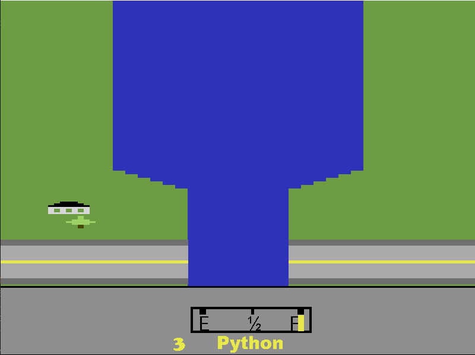
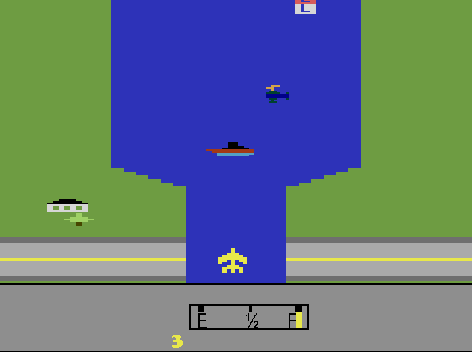
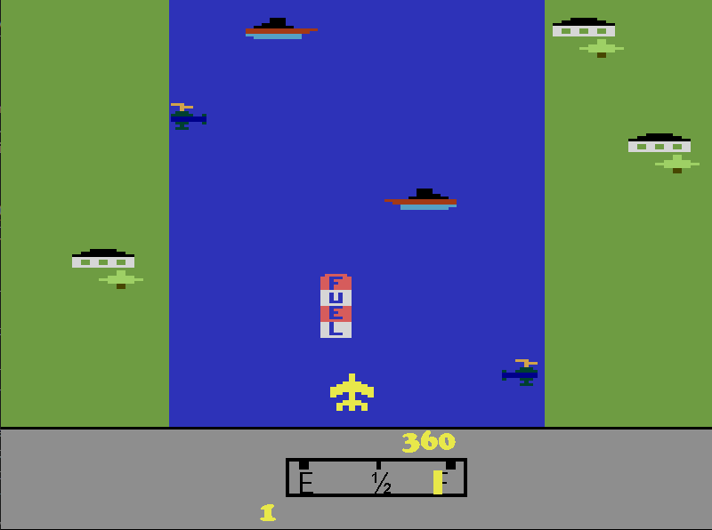

# River Raid Cover

Este é um clone do clássico jogo **River Raid**, desenvolvido em Python utilizando a biblioteca **Pygame**. O objetivo do jogo é controlar um avião, desviar de obstáculos, destruir inimigos e gerenciar o nível de combustível para alcançar a maior pontuação possível.

## 🎮 Como Jogar

- **F12**: Inicia o jogo.
- **Seta para a Esquerda/Direita**: Move o avião para os lados.
- **Seta para Cima**: Aumenta a velocidade.
- **Seta para Baixo**: Diminui a velocidade.
- **Espaço**: Atira.

Evite colidir com obstáculos e inimigos, e colete combustível para continuar voando!

## 🛠️ Instalação

1. Certifique-se de ter o Python 3.8+ instalado em sua máquina.
2. Clone este repositório:
   ```bash
   git clone https://github.com/Jetsetjedi/River-Raid-cover.git
   cd river-raid-cover
3. Crie um ambiente virtual e instale as dependencias:
    python -m venv venv
    source venv/bin/activate  # No Windows: venv\Scripts\activate
    pip install pygame
4. Execute o jogo:
    python RiverRaid.py

 📂 Estrutura do Projeto

 River_Raid/
├── [cores.py](http://_vscodecontentref_/0)          # Definição de cores usadas no jogo
├── [ilhas.py](http://_vscodecontentref_/1)          # Implementação das ilhas
├── [obj.py](http://_vscodecontentref_/2)            # Implementação de objetos (aviões, helicópteros, etc.)
├── [place.py](http://_vscodecontentref_/3)          # Implementação de terrenos
├── [ponte.py](http://_vscodecontentref_/4)          # Implementação das pontes
├── [shot.py](http://_vscodecontentref_/5)           # Implementação do tiro
├── [RiverRaid.py](http://_vscodecontentref_/6)      # Arquivo principal do jogo
├── sons/             # Sons usados no jogo
│   ├── explode.wav
│   ├── gaz_alert.wav
│   ├── ...
└── [REDAME.md](http://_vscodecontentref_/7)         # Este arquivo   

🚀 Funcionalidades
Controle do avião com movimentação fluida.
Sistema de colisão com inimigos e obstáculos.
Gerenciamento de combustível.
Sons imersivos para tiros, explosões e alertas de combustível.

🖼️ Capturas de Tela





🤝 Contribuindo
Contribuições são bem-vindas! Siga os passos abaixo para contribuir:

1. Faça um fork do repositório.

2. Crie uma branch para sua feature ou correção:
   git checkout -b minha-feature

3. Faça commit das suas alterações:
   git commit -m "Adicionei uma nova feature"

4. Envie para o seu fork:
   git push origin minha-feature
5.Abra um Pull Request.


📜 Licença
Este projeto está licenciado sob a licença MIT. Veja o arquivo LICENSE para mais detalhes.

Desenvolvido com ❤️ por Jether Feliciano. Conecte-se comigo no LinkedIn!
https://www.linkedin.com/in/jetherfeliciano/
